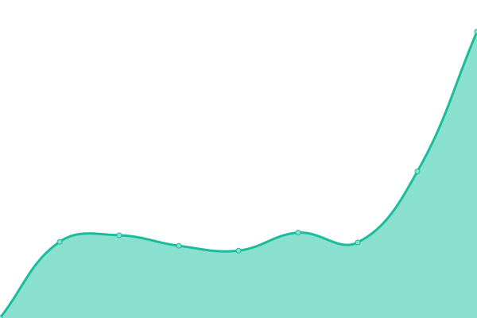
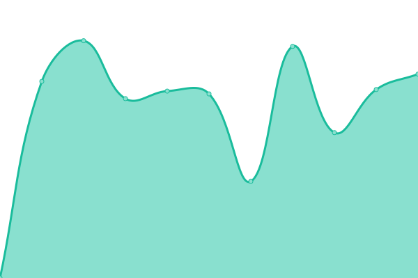
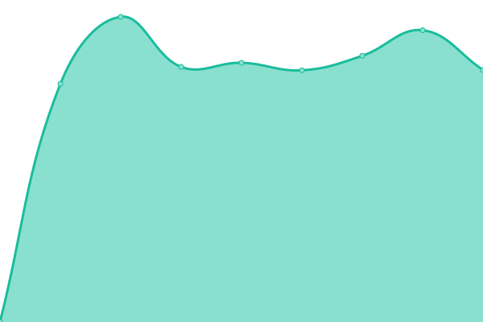
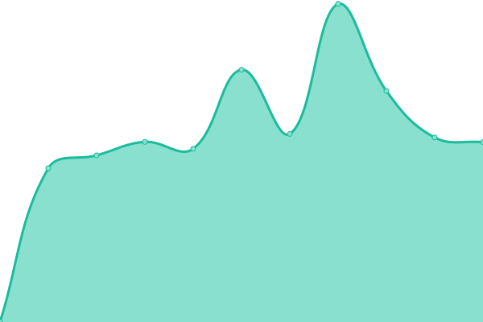

# [📈 Live Status](https://xoff1337.github.io/xoff1337): <!--live status--> **🟨 Partial outage**

This repository contains the open-source uptime monitor and status page for [XOFF](x-off.ru), powered by [Upptime](https://github.com/upptime/upptime).

With [Upptime](https://upptime.js.org), you can get your own unlimited and free uptime monitor and status page, powered entirely by a GitHub repository. We use [Issues](https://github.com/xoff1337/xoff1337/issues) as incident reports, [Actions](https://github.com/xoff1337/xoff1337/actions) as uptime monitors, and [Pages](https://xoff1337.github.io/xoff1337) for the status page.

<!--start: status pages-->
<!-- This summary is generated by Upptime (https://github.com/upptime/upptime) -->
<!-- Do not edit this manually, your changes will be overwritten -->

| URL                                   | Status  | History                                                                                            | Response Time                                                                       | Uptime                                                                                                                                                                                                                         |
| ------------------------------------- | ------- | -------------------------------------------------------------------------------------------------- | ----------------------------------------------------------------------------------- | ------------------------------------------------------------------------------------------------------------------------------------------------------------------------------------------------------------------------------ |
| [1nf](https://xn--1-ztbv.xn--p1ai)    | 🟥 Down | [1nf.yml](https://github.com/xoff1337/xoff1337/commits/master/history/1nf.yml)                     |  2422ms           |                       |
| [60x7.ru](https://60x7.ru)            | 🟥 Down | [60x7-ru.yml](https://github.com/xoff1337/xoff1337/commits/master/history/60x7-ru.yml)             |  2381ms       |               |
| [HIGHTECH](https://gk-ht.ru)          | 🟩 Up   | [hightech.yml](https://github.com/xoff1337/xoff1337/commits/master/history/hightech.yml)           |  1476ms      |            |
| [mail.x-off.ru](http://mail.x-off.ru) | 🟩 Up   | [mail-x-off-ru.yml](https://github.com/xoff1337/xoff1337/commits/master/history/mail-x-off-ru.yml) |  2658ms |  |

<!--end: status pages-->

[**Visit our status website →**](https://xoff1337.github.io/xoff1337)

## 📄 License

- Code: [MIT](./LICENSE) © [XOFF](x-off.ru)
- Data in the `./history` directory: [Open Database License](https://opendatacommons.org/licenses/odbl/1-0/)
