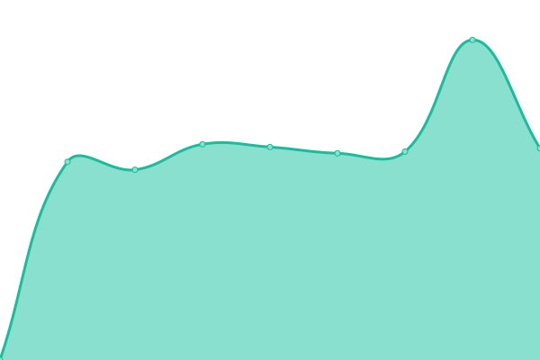

# [📈 Live Status](https://xoff1337.github.io/xoff1337): <!--live status--> **🟩 All systems operational**

This repository contains the open-source uptime monitor and status page for [XOFF](x-off.ru), powered by [Upptime](https://github.com/upptime/upptime).

With [Upptime](https://upptime.js.org), you can get your own unlimited and free uptime monitor and status page, powered entirely by a GitHub repository. We use [Issues](https://github.com/xoff1337/xoff1337/issues) as incident reports, [Actions](https://github.com/xoff1337/xoff1337/actions) as uptime monitors, and [Pages](https://xoff1337.github.io/xoff1337) for the status page.

<!--start: status pages-->
<!-- This summary is generated by Upptime (https://github.com/upptime/upptime) -->
<!-- Do not edit this manually, your changes will be overwritten -->
<!-- prettier-ignore -->
| URL | Status | History | Response Time | Uptime |
| --- | ------ | ------- | ------------- | ------ |
|  [1nf](https://xn--1-ztbv.xn--p1ai) | 🟩 Up | [1nf.yml](https://github.com/xoff1337/xoff1337/commits/HEAD/history/1nf.yml) | 

 2210ms
     
 | 

<a href="https://xoff1337.github.io/xoff1337/history/1nf">100.00%</a>
    

|  [60x7.ru](https://60x7.ru) | 🟩 Up | [60x7-ru.yml](https://github.com/xoff1337/xoff1337/commits/HEAD/history/60x7-ru.yml) | 

 3856ms
     
 | 

<a href="https://xoff1337.github.io/xoff1337/history/60x7-ru">100.00%</a>
    

|  [mail.x-off.ru](http://mail.x-off.ru) | 🟩 Up | [mail-x-off-ru.yml](https://github.com/xoff1337/xoff1337/commits/HEAD/history/mail-x-off-ru.yml) | 

 2941ms
     
 | 

<a href="https://xoff1337.github.io/xoff1337/history/mail-x-off-ru">100.00%</a>
    

|  [x-off.ru](http://x-off.ru) | 🟩 Up | [x-off-ru.yml](https://github.com/xoff1337/xoff1337/commits/HEAD/history/x-off-ru.yml) | 

 1630ms
     
 | 

<a href="https://xoff1337.github.io/xoff1337/history/x-off-ru">100.00%</a>
    

<!--end: status pages-->

[**Visit our status website →**](https://xoff1337.github.io/xoff1337)

## 📄 License

- Code: [MIT](./LICENSE) © [XOFF](x-off.ru)
- Data in the `./history` directory: [Open Database License](https://opendatacommons.org/licenses/odbl/1-0/)
